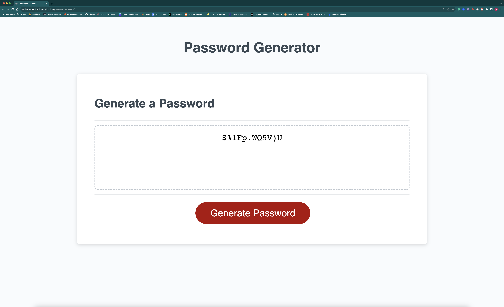

# Password Generator

## Description

This repo contains all the components that build a password generator app. It was built with the intention of creating a password much faster than making one up. In creating this app, I was able to ease and speed up the process of creating passwords to sign up for anything.

## Table of Contents

1. [Installation](#installation)
2. [Usage](#usage)
   * [Step 1](#step-1-open-browser)
   * [Step 2](#step-2-press-the-generate-password-button)
   * [Step 3](#step-3-enter-password-length)
   * [Step 4](#step-4-select-at-least-one-character-type)
   * [Step 5](#step-5-password-generated)
3. [License](#license)
4. [Deployed-Link](#deployed-link)

## Installation

N/A.

## Usage

In order to use this app to generate your own passwords, simply click on the following link, or enter it in a browser.

[https://hebermartinezlopez.github.io/password-generator/](https://hebermartinezlopez.github.io/password-generator/)

### Step 1. Open Browser.

### Step 2. Press the Generate Password Button.

### Step 3. Enter Password Length.

### Step 4. Select At Least One Character Type

### Step 5. Password Generated!

## License

Please refer to LICENSE in the repo.

## Deployed Link

[https://hebermartinezlopez.github.io/password-generator/](https://hebermartinezlopez.github.io/password-generator/)
